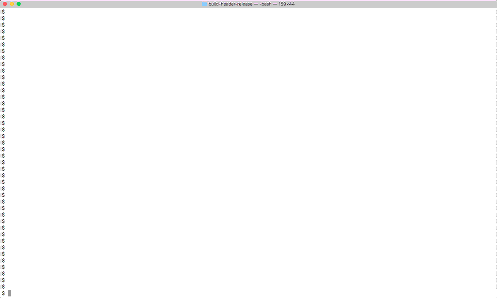

# ASCII ART

C++ implementation of image to ASCII art conversion. 

The main functionality is in `ascii_art` in `ascii_art.h`. For general inputs
I use `stb_image_resize.h` to resize the input. Otherwise, the only dependency
is the standard library.

There are three executable demos exposing this:

## `image2ascii`

Convert an input image into ASCII art

For example, if you issue:

    ./image2ascii ../max-schmeling.jpg

You'll see:

```


                          ______
                     __qMMMMMMMMMMp___
                   _qMMMMMMMMMMMMMMMQQp_
                  _QMMMMMMMMMMQMMMMMMMQMQ_
                 _QMMMMMMMMMMMMMMMMMMMMMMQy
                qMMMMMME``` `""""#WMMMMMMQ#_
               qMMMMMQE@`            `@MMMMp
               qMMMMME@"`             _@MMMp
             _qQMMMME"`__p_____      ___MW^
            _qMD?,3ME"`@@@7_QMM@   qQMMMQ
            @MM   qM@`      7 ``  -"7WE@@
            "QMp  _E@`            "    -@
            _QMM_  Q@_            "`    @
            qMMMMQpj@@         -__;)  `_
            @MMMMMMQp@"         ` @__ _'
             @MMMMMMQ@_`   ,=--,,,_@" j
              `7MMMMQMpjj`    _qp_@-`j@_
                "MMMMpMQpp__`````_pqp@@@`"-,_                         _qMMMMMQp_
                 @MMMQp"7MQp___;_jQF````     `"--,__             _pQqqMMMMMMMMMMp_
                  MMMMM_  `7WWWMW^              __g@@@=--u__      MMMMMMMMMMMMMMMMp
                  _QMMMMMMp__           _,.- -"@@@@"`     `"@@_    MMMMMMMMMMMMMQMMp
                _qMMMMMMMMMMQ_        ```     ``"``          `MQp_ dMMMQQMMMMMQQQMMMp
               _qMMMMMMMMMMMMMp    ,,`        ```             `TMMp_MMMMQQ@QMMMMMMMMQ
            _qQMMMMMMMMMMMMMMMMp-"" `                           "MMMMMMMQ@""@MMMMMMMMp
        __g@@qQMMMMMMMMMMMMMMMMMp                               _QMMMMMMQQp_@QQMMMMMM"
      _q@@@@@MMMMMMMMMQMMMMMMMMMp;.                             "MMMMMMQMMMQMQMMMMMM#
      #@@@@@qMMMMMMMMQQQQqQQMMM#                                 MMMMMMMMMQMQMQMMMMM`
    _qQ@@@_qMMMMMMMMMMMQMMQQQME `                       _`       `9MMMMMMMMMMMMQMMMM
    gQ@@@qMMMMMMMMMMMMMMMMMW7`_p_`                     _p_         qMMQMMMMMQMMMMMMF
   q#M@@qMMMQMMQQMQMMMMMW"   `=Q__                    _jQp         `MMMMQMQMMMQQME"
   qpE@@@MMMMMQMQMMMQQMb       J@@`                  `@MMQ_          7MMQMMMMMWQMM_
   Q#Q@@@@@MMQ@FMQMMQMD        j@@-`                  `"WWMQ_         `MMQ``7T7QMEMp
   QMQQQ@@qMME@j-:`WWE          `@_`                        Mp_        q#M@";"@@@@@Mp
   qMpQQ@_QQQ@__j"` _@          _@@_        ____             9Qp_      q#@@;`"@@@"jMMp
   "M#QE@QMME@@_ - -j@_         `j@@@`      "@@@   ;         `JMQp_    q#@``   _@@@@Q#
    q#Q@qMQQy""`_ ;@qp@``        "@@@@`                      `@QMMp_   qM@````""@Q@@Q#
    qMQQMME@j_-`@"%_qMp___ __;    @"`"`                 ``` __@QMMMQp jqQ@__ ```_@QQQ#
    #QQMMEp@@"-"-`@@#ME@@_@@"`   `;```                  ```""@@MMMMMMp__#p@"`__j@@@QM#
   qMQMMME@_`""-_`j@#MMQ@@@j"`    `;"`                   ```"@QMMMMMMMMpFMQp@j@@Q@@@Q#
   QMMMQM@@-@%""- jqMMQQ@@@@@@`    `_``                   ``"@Q"MMMMMMMMMQpQQ_QW@@@@Q`
  qMMMQQ@p@@j_ "-_@qQMMQ@@@@@@__-  `--`                  ```"@Q_`@MMMMMMMMMQQQMMp@@@
 _QMMMQQQ@@__""%_j@MMMMQQQ@@@@@@_`  "```               ` ``""@Qp  "MMMMMMMMMMMME"`
 qMMMQQQQ@@@_@"__@QQMQQMMQ@@@@@@____";``                 ```"_@g_  `@MMMMMMMMMME`
 QMQQMQQQ@@@@@j@jQQKMMMQQQQQQ@@@@@@@j@___`      ````    ___pqMQQ#    `?MMMMMMME@
 MMMMMMMQ@@@@j@@QQ# qMMQQQMQQQQQ@@@@_@p@@_   _______pQQMQMMMMMEMy        `"7T"`
 "MMMQE@@@@@@@qQQK  qMMQQQQQQQQQQ____QQppQqMMQMMQMMMMMM#QQpQWQQM#_
   MMQp@@@@@@qQW"   "MMMMMMMMMQQMQQQQQMEEMMMMQQQqqQWQ#QMQMMMMQQQQQp
   `MMMQQQ___QF`    qMMMQMMMM#QMpQQQMQM##QMMQQQQMMMMM#QQQpQQMMMMMMQp_
    7MMMMQMMW"       qMQQMQQMMMMMMp#MMQMMMMMQMMQQQMQMMMMQMMMMMMMMMMMMp
      `7WWF"         qMMMQQQQQQQQQQQQQQQQQMMMMMMMMMMMMMMMMQQMMMMMMMMMMp_
                    qMMMMMMMMMMMMMMMMMMMMMMMMMMMMMMMMMQQMMQMMMMMMMMMMMM#_
                   _QMMMMMMMMMMMMMMQMMMMMMMMMMMMMMMMMMMMMMMMMMMMMQMMMMMMp
                   qMMMMMMMMMMMMMMMMMMMMMMMMMMMMMMMQQQMMMMMMMMMMMMMMMMMMM_
                   QMMMMMMMMMMMMMMMMMMMMMMMMMMMMMMMMMMMMMMMMMMMMMQQMMMMMM#
                  _QMMMMMMMMMMMMMMMMQMMMMMMMMMMMMMMMMMMMMMMMMMMQMMMMMMMMMM
```

## `spy`

Visualize a matrix similar to MATLAB's `spy` command, but as ASCII art. This
command constructs the cotangent Laplacian of an input triangle mesh and
visualizes this sparse matrix to the terminal:

For example, if you issue:

    ./spy ../suzanne.obj

You'll see:

```
',                           _, ,.i .  .                 ~`7^*==,i,_____  .  i .__    `*=<___  .__  j,i.
  ',                             u                              ^"`77"`**~==CkiQ______   "``*~=k,___
    ',                       `7W~~8W2,Q`j?j___" '     __"                                           7=JTQ@j_""   _
      ',                     _         _     ``7"*>~=wci,                            j             _    _   7^%wmi
        ',                     `^*=a___,_u,   ,                                                      "w___, .
          ',                           `^v=L__` ` __   ,"                                               `^=_]"_
            ',                                 `^6AQ_g_                                                      ^k__
              ',                                       `7*=aQ_x                       m_+                        `
                ',           j& *-~                            `7*w,_,- *    ~    _      ^qp"  -    s"-
                  ',                                                  `7*=upp_^ `           ^wx=
                    ',                                   __                   `7^=uQ_^          7wQt
                      ',                                    ``7">~~=<i,,___            `7*=i__
                        ',   ,,___                                           ``7^*~=<i         `^*=i__
                          ',       ```7^~~=ii,____                                                     `^*=.__
 ,     (         ,       ,  '_         .           ``7"^~          _.                               _          `"~
 )  L   _                }    9__  J     -                      _ ?                                 3_<  "
 `  d   [       ^  _     j     nAg .                             ]           _                       5_
    L   (_                    _   3y     _?   _                                                       3_ _/
    -p   \                b   -     9_<`_                                                              \6_
    `K   5_               {  _      /<Rp                                                                \ ^
    ]]  _C[               d        ( `  5gr   " `       "                                                3e `"
    ^j   `?_                      *   ` " B_ y-        g                                                  3_-    -
     (p    ]               y               yM_"   _>                                                       A* _ "
    '!)  ""7p              }       "    -   \ 0_<_,     -                                                   \</  -
    ' [   :"j              3            :     C_BQ.  _                                                       K,
      O    q"p                              _x `  9_ V,                                                       \>y
      _     _j              b                    ___jQ<                                                        q\
     \"p   ) U_             ]              j~ -    ` ~5_y                                                       ^_
_   ;  %  -   V             d           ; ~   /        TR__ _,                        _,,                        7
b             J_     "                                   `Wg_ l                       \_"
j             ;1      b                                  s ?WQ _                       T,_
M             ?__     )                                   "   jp                        \.
 )[             \     j        "y,                           `  Mp      u    _           \  ^  ,     r
 }b              p    "      _*                                   Mp_y                    V/        f
 q)              #     p                                          _JR_          :_>        y     _ "
 ({               p    )                                          ` < 9p    ~ _ p`          p    ^
  d             " 3    [                                         "      8p___                b_C
  d                y   d                                                 -5Q`                "Q
 _Rp              =0             _                               r      .-"`Rg                 @      _
   p              ! p   )                                              ?      AQ                E
 j #              C q   [                                           `_Y`        Bp  y^           y_6
  `#             ?  :p  "                                           ?`          : 9p .            @/
   d   y            J3   p                                                      y*  ?_             y
V             ?y                                         7Pe__                        ',
M__           " _     \                                  "`  L7x__                      ',
 l)              k     _                                          _Mm_                    ',
 `4             ~ \    \                                        >~  ` "^e__                 ',
 _F               C\    _                                        ,    - .<=*q_                ',
 \.L             _- \   \                                            _,-      7^m_              ',
   I   _            j\   _                                                      jw^"<_            ',
 )  L   _       .        \   `?<_                               . ^`                                ',
    y   Gg                _   _  JD<_                            `           `                        ',
    Q) = fb               \  =.    .R[7w_                                                               ',
    'q   "/_                      *`  "  `b&_                                                             ',
    ['L  ")!p              (       `    ,   ^ Te_                                                           ',
      U    v"_              p                < `  P<__                                                        ',
     j"p   - T_             l              L~     `^`~>q_                                                       ',
```

## `ascii3d`

Ray trace an input 3D triangle mesh or 3D scene as ASCII art. 

For example if you issue,

   ./ascii3d ../suzanne.obj

You'll see:

```
                              _____mmmmmmmmmm_____                              
                          __p@@@@"""""""""""""""@@@m__                          
                        _g@@@"`___``   ``   ``___`"@@@p_                        
                      _d@@@@_j"`  `%_      _/`  `"@_@@@@@_                      
                     /@@@@j@`       @_    _@       `%@j@@@h                     
                    j@j@"` _;````";_ "_  _@ _;"````;_ `"@@@k                    
          -'___  _ _@` __@"`__, ,_ `- `""` ;" _ ,,__`"%__ `@_ _  ___'-          
        ,  _QQQQp_^#@@"`` j@_-``-_%  `    `  ;_-``"_@@ ```"@@"_qQQQQ__ \        
        @ j    `7QpQ@@_   @@"    j_          _)    `@@   _j@QQp@`    % _        
        ) |``   @@@Qp@@_;_"@@____@@          @@____y@/_;_j@qQE@@   ``j j        
         @ ,``` @@@@QQp@__@_"R@@@`-           `@@@R"_@"_jqQW@@@@ ```, j`        
          "__~__"@@qQMQQp@j_@@""`              `""@@__jqQMMQ@@@"__-"jF          
            `%m___"@WMMMMMQQQpp____          ____jQQQQMMMMMK@"___p="            
                 `77777``7FWMMQQQQQp__ __ __jQQQQQMMWF7```7777`                 
                             7WMQMME__    _pQMMQMW^                             
                                3ME@"@mjjpF"@MMK`                               
                                 @@"        "@@                                 
                                _@@`        `"@_                                
                                (@"          `@]                                
                                #@`          `@@                                
```````````````````````````    _@@`          `"@p    ```````````````````````````
``````````````_________________q@"`  _q__p_  `"@p_________________``````````````
             ````"""""""%%@@@@@q@@___"_``_@____@p@@@@@@%""""""""```             
                         ```````Wp__pppppppp__q#"```````                        
                                ``````77777``````                               
```

This ray-tracer is **interactive**

Try hitting the `hjklJK` keys to interact with the 3D scene:



## Compilation

    mkdir build
    cd build
    cmake ../ -DCMAKE_BUILD_TYPE=Release
    make 

Demos depends on libigl, stb, Eigen, Embree.
